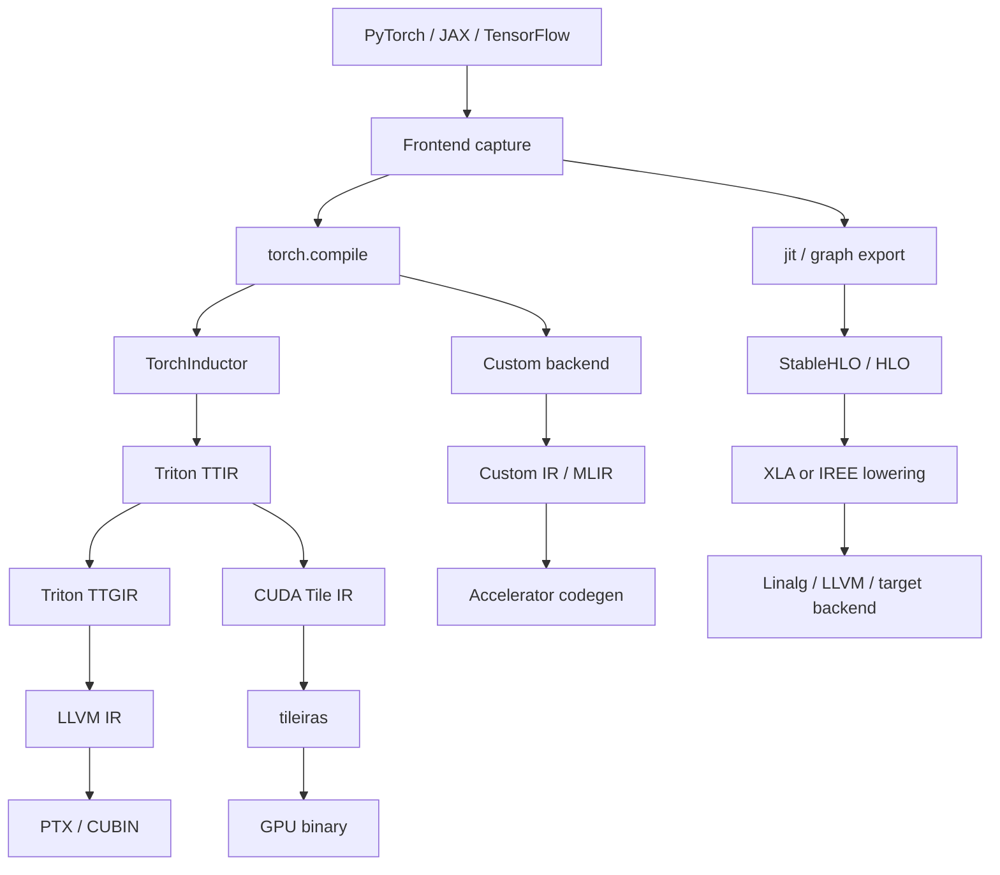

# AI Compiler Ecosystem

## Reading frame

- Triton: kernel-centric GPU compiler path.
- StableHLO/XLA: graph-level portability and optimization path.
- IREE: end-to-end compiler/runtime system with explicit lowering stages.
- CUDA Tile IR: alternative GPU backend abstraction below Triton IR.
